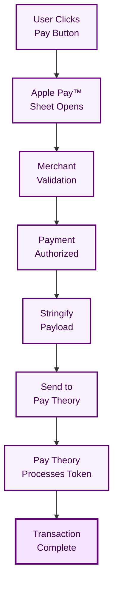

# Apple Pay™ on Web

Implement Apple Pay™ payments on your website using the Pay Theory JavaScript SDK.

---

## Apple Pay™ Setup

### 1. Register Your Domain

1. Log in to [Pay Theory Portal](https://portal.paytheory.com)
2. Navigate to Settings → Apple Pay Configuration
3. Download the domain verification file
4. Upload file to your server at:
   ```
   https://yourdomain.com/.well-known/apple-developer-merchantid-domain-association
   ```

### 2. Verify Your Domain

1. Return to Pay Theory Portal
2. Click **Verify Domain** button
3. Ensure verification shows "Active" status
4. Your domain is now ready for Apple Pay™

---

## Merchant Configuration

### Required Session Parameters

When creating an Apple Pay™ session, you must configure:

```javascript
const paymentRequest = {
  countryCode: 'US', // Your merchant country
  currencyCode: 'USD', // Transaction currency
  supportedNetworks: ['visa', 'masterCard', 'amex', 'discover'],
  merchantCapabilities: ['supports3DS'],
  total: {
    label: 'Your Business Name', // Your merchant display name
    amount: '10.00', // Transaction amount
  },
};
```

:::warning Important Configuration

- **countryCode**: Must match your merchant registration country
- **merchantCapabilities**: Must include `supports3DS` for Pay Theory processing
  :::

### Finding Your Configuration

1. Log in to your Pay Theory Dashboard
2. Navigate to Settings → Developers
3. Your Merchant ID is displayed at the top of the page
4. Use this for Apple Pay™ session configuration

---

## Implementation

### 1. Include Required Scripts

```html
<!-- Apple Pay™ SDK -->
<script
  crossorigin
  src="https://applepay.cdn-apple.com/jsapi/1.latest/apple-pay-sdk.js"></script>

<!-- Pay Theory SDK -->
<script src="SDK IMPORT URL"></script>
```

### 2. Initialize Pay Theory Messenger

```javascript
// Initialize Pay Theory Messenger
let messenger;

async function initializePayTheory() {
  try {
    messenger = new window.PayTheoryMessenger({
      apiKey: 'YOUR_PAY_THEORY_API_KEY',
    });
    await messenger.initialize();
    console.log('Pay Theory Messenger initialized');
  } catch (error) {
    console.error('Failed to initialize:', error);
  }
}

// Initialize on page load
window.addEventListener('DOMContentLoaded', initializePayTheory);
```

### 3. Configure Apple Pay™

```javascript
// Apple Pay™ configuration
const APPLE_PAY_CONFIG = {
  countryCode: 'US',
  currencyCode: 'USD',
  supportedNetworks: ['visa', 'masterCard', 'amex', 'discover'],
  merchantCapabilities: ['supports3DS'],
};

// Check if Apple Pay™ is available
function checkApplePayAvailability() {
  if (window.ApplePaySession && ApplePaySession.canMakePayments()) {
    renderApplePayButton();
  } else {
    console.log('Apple Pay™ is not available');
  }
}
```

### 4. Check Apple Pay™ Availability

```javascript
async function checkApplePayAvailability() {
  // Check browser support
  if (!window.ApplePaySession) {
    console.log('Apple Pay™ is not supported in this browser');
    return;
  }

  // Check if device has cards
  if (ApplePaySession.canMakePayments()) {
    renderApplePayButton();
  } else {
    console.log('No cards configured for Apple Pay™');
  }
}
```

### 5. Render Apple Pay™ Button

```javascript
function renderApplePayButton() {
  const button = document.getElementById('apple-pay-button');
  button.style.display = 'block';
  button.onclick = handleApplePay;
}
```

```html
<style>
  .apple-pay-button {
    display: none;
    -webkit-appearance: -apple-pay-button;
    -apple-pay-button-type: plain;
    -apple-pay-button-style: black;
    width: 240px;
    height: 45px;
    cursor: pointer;
  }
</style>

<button id="apple-pay-button" class="apple-pay-button">Apple Pay</button>
```

### 6. Handle Apple Pay™ Transaction

:::note Merchant Validation
Merchant validation is required for Apple Pay™ transactions. You can use the `getApplePaySession` method to get the session data and complete the merchant validation.
:::

```javascript
async function handleApplePay() {
  if (!messenger) {
    console.error('Pay Theory not initialized');
    return;
  }

  const amount = 1000; // Amount in cents ($10.00)

  // Create payment request
  const paymentRequest = {
    ...APPLE_PAY_CONFIG,
    total: {
      label: 'Your Business Name',
      amount: (amount / 100).toFixed(2), // Convert cents to dollars
    },
  };

  // Create Apple Pay™ session
  const session = new ApplePaySession(3, paymentRequest);

  // Handle merchant validation
  session.onvalidatemerchant = async event => {
    try {
      // Get session from Pay Theory
      const response = await messenger.getApplePaySession();

      if (response.type === 'SUCCESS' && response.session) {
        const sessionData = response.session.session || response.session;
        session.completeMerchantValidation(sessionData);
      } else {
        throw new Error('Merchant validation failed');
      }
    } catch (error) {
      console.error('Validation error:', error);
      session.abort();
    }
  };

  // Handle payment authorization
  session.onpaymentauthorized = async event => {
    try {
      // Process with Pay Theory
      const result = await messenger.processWalletTransaction({
        amount: amount,
        digitalWalletPayload: JSON.stringify(event.payment),
        walletType: window.PayTheoryMessenger.applePay,
      });

      if (result.type === 'SUCCESS') {
        const transaction = result.transaction;

        if (
          transaction.status === 'PENDING' ||
          transaction.status === 'SUCCEEDED'
        ) {
          session.completePayment(ApplePaySession.STATUS_SUCCESS);
          showSuccessMessage(transaction);
        } else {
          session.completePayment(ApplePaySession.STATUS_FAILURE);
          showErrorMessage(transaction.failure_reasons);
        }
      } else {
        session.completePayment(ApplePaySession.STATUS_FAILURE);
        showErrorMessage(result.error);
      }
    } catch (error) {
      session.completePayment(ApplePaySession.STATUS_FAILURE);
      showErrorMessage(error.message);
    }
  };

  // Start the session
  session.begin();
}
```

### 7. Handle Transaction Results

```javascript
function showSuccessMessage(transaction) {
  console.log('Payment successful!', {
    transactionId: transaction.transaction_id,
    amount: transaction.gross_amount,
    status: transaction.status,
    cardBrand: transaction.payment_method?.card_brand,
    lastFour: transaction.payment_method?.last_four,
  });
  // Update UI to show success
}

function showErrorMessage(error) {
  console.error('Payment failed:', error);
  // Update UI to show error
}
```

---

## Payment Data Transmission

### Preparing the Token

After receiving payment data from Apple Pay™, stringify it for use with Pay Theory:

```javascript
// Get payment data from Apple Pay™
const paymentData = event.payment;

// Stringify the entire response
const walletPayload = JSON.stringify(paymentData);
```

### Processing Options

You can now use `walletPayload` with either:

#### Option 1: Pay Theory Messenger SDK

Pass the stringified payload to the `digitalWalletPayload` parameter:

```javascript
await messenger.processWalletTransaction({
  amount: 1000, // Amount in cents
  digitalWalletPayload: walletPayload,
  walletType: window.PayTheoryMessenger.applePay,
});
```

See [processWalletTransaction documentation](../../../../sdk/javascript/messenger/processWalletTransaction) for details.

#### Option 2: GraphQL API

Use the stringified payload in the `digital_wallet` field:

- For authorization: Pass to `digital_wallet` in the wallet authorization endpoint - see [API Reference](../../../../api/authorization#create-wallet-authorization)
- For direct transaction: Pass to `digital_wallet` in the wallet transaction endpoint - see [API Reference](../../../../api/transaction#create-wallet-transaction)

See the respective API documentation for complete implementation details.

---

## Token Processing

### Pay Theory's Role

Pay Theory handles only the final encrypted payment token processing:

1. **You handle**: Apple Pay™ session setup, merchant validation, user interaction
2. **Pay Theory handles**: Token decryption, payment processing, 3DS (if needed), settlement

### Token Payload Requirements

The Apple Pay™ payment data must include:

- Valid payment token from Apple
- Payment network information
- Transaction details

### Processing Flow



:::note Token Validity
Apple Pay™ tokens are single-use and expire quickly. Process them immediately after receiving from Apple Pay™.
:::

---

## Testing

1. Use Safari on a real Apple device
2. Test with sandbox API keys from Pay Theory
3. Add test cards to your Apple Wallet
4. Ensure domain is verified in Pay Theory portal
5. Switch to production keys when ready to go live
