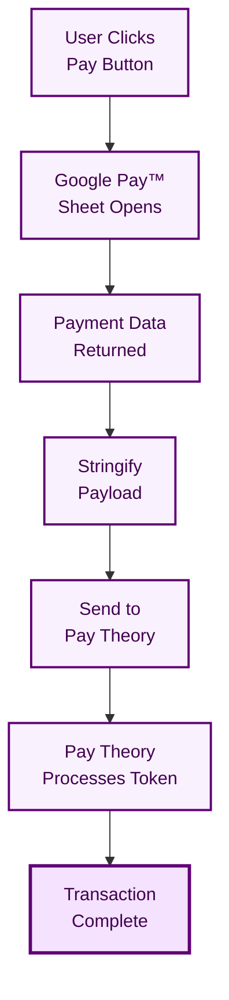

# Google Pay™ on Web

Implement Google Pay™ payments on your website using the Pay Theory JavaScript SDK.

---

## Google Pay™ Console Setup

### 1. Register Your Business

1. Visit [Google Pay & Wallet Console](https://pay.google.com/business/console)
2. Sign in with your Google account
3. Complete the business profile
4. Accept Google Pay™ API Terms of Service

### 2. Configure Gateway Integration

1. Select **Web** as your integration type
2. Choose **Gateway** integration
3. Enter gateway details:
   - **Gateway**: Pay Theory
   - **Gateway Merchant ID**: Your Pay Theory Merchant ID

### 3. Add Your Website

1. Click **Add website** in the console
2. Enter your production domain
3. Google will verify your SSL certificate
4. Status should show as "Active"

:::note Development Testing
Use `environment: 'TEST'` for local development. Production domain registration is only required for live transactions.
:::

---

## Billing Address Requirements

:::danger Required for All Transactions
**Billing address is REQUIRED for all Google Pay™ transactions.** Pay Theory requires complete billing information to process payments successfully. Transactions without billing address will be rejected.
:::

### Required Billing Address Fields

When configuring Google Pay™, you must set `billingAddressRequired: true` with the following parameters:

```javascript
billingAddressParameters: {
  format: 'FULL',           // Required - returns complete address
  phoneNumberRequired: true  // Required - phone number must be included
}
```

### Billing Address Validation

The billing address returned from Google Pay™ will include:

- Full name
- Street address (line 1 and optional line 2)
- City
- State/Province
- Postal/ZIP code
- Country code
- Phone number

Pay Theory validates all billing address fields before processing. Missing or invalid billing information will result in transaction failure.

---

## Gateway Configuration

### Required Gateway Parameters

When configuring the tokenization specification for Google Pay™, you must use the exact values below:

```javascript
tokenizationSpecification: {
  type: 'PAYMENT_GATEWAY',
  parameters: {
    gateway: 'paytheory',              // MUST be exactly 'paytheory' (lowercase)
    gatewayMerchantId: 'PAY_THEORY_MERCHANT_UID'  // Your Pay Theory Merchant ID
  }
}
```

:::warning Important Gateway Values

- **gateway**: Must be exactly `'paytheory'` (all lowercase, no spaces)
- **gatewayMerchantId**: Your Pay Theory Merchant ID (found in your Pay Theory dashboard)
  :::

### Finding Your Merchant ID

1. Log in to your Pay Theory Dashboard
2. Navigate to Settings → Developers
3. Your Merchant ID is displayed at the top of the page
4. Use this exact value for `gatewayMerchantId`

---

## Implementation

### 1. Include Required Scripts

```html
<!-- Google Pay™ API -->
<script src="https://pay.google.com/gp/p/js/pay.js"></script>

<!-- Pay Theory SDK -->
<script src="SDK IMPORT URL"></script>
```

### 2. Initialize Pay Theory Messenger

```javascript
// Initialize Pay Theory Messenger
let messenger;

async function initializePayTheory() {
  try {
    messenger = new window.PayTheoryMessenger({
      apiKey: 'YOUR_PAY_THEORY_API_KEY',
    });
    await messenger.initialize();
    console.log('Pay Theory Messenger initialized');
  } catch (error) {
    console.error('Failed to initialize:', error);
  }
}

// Initialize on page load
window.addEventListener('DOMContentLoaded', initializePayTheory);
```

### 3. Configure Google Pay™

```javascript
// Google Pay™ configuration
const GOOGLE_PAY_CONFIG = {
  environment: 'PRODUCTION', // Use 'TEST' for development
  apiVersion: 2,
  apiVersionMinor: 0,
  merchantInfo: {
    merchantName: 'Your Business Name',
    merchantId: 'YOUR_GOOGLE_MERCHANT_ID', // Required for PRODUCTION
  },
  allowedPaymentMethods: [
    {
      type: 'CARD',
      parameters: {
        allowedAuthMethods: ['PAN_ONLY', 'CRYPTOGRAM_3DS'],
        allowedCardNetworks: ['AMEX', 'DISCOVER', 'JCB', 'MASTERCARD', 'VISA'],
        billingAddressRequired: true,
        billingAddressParameters: {
          format: 'FULL',
          phoneNumberRequired: true,
        },
      },
      tokenizationSpecification: {
        type: 'PAYMENT_GATEWAY',
        parameters: {
          gateway: 'paytheory',
          gatewayMerchantId: 'YOUR_PAY_THEORY_MERCHANT_ID',
        },
      },
    },
  ],
};

// Initialize Google Pay client
let googlePaymentsClient;
```

### 4. Check Google Pay™ Availability

```javascript
async function checkGooglePayAvailability() {
  // Create payments client
  googlePaymentsClient = new google.payments.api.PaymentsClient({
    environment: GOOGLE_PAY_CONFIG.environment,
  });

  // Check if Google Pay™ is available
  const isReadyToPayRequest = {
    apiVersion: GOOGLE_PAY_CONFIG.apiVersion,
    apiVersionMinor: GOOGLE_PAY_CONFIG.apiVersionMinor,
    allowedPaymentMethods: GOOGLE_PAY_CONFIG.allowedPaymentMethods,
  };

  try {
    const response =
      await googlePaymentsClient.isReadyToPay(isReadyToPayRequest);
    if (response.result) {
      renderGooglePayButton();
    } else {
      console.log('Google Pay™ is not available');
    }
  } catch (error) {
    console.error('Error checking Google Pay availability:', error);
  }
}
```

### 5. Render Google Pay™ Button

```javascript
function renderGooglePayButton() {
  const button = googlePaymentsClient.createButton({
    onClick: handleGooglePay,
    buttonType: 'plain',
    buttonColor: 'black',
    buttonSizeMode: 'fill',
  });

  // Add button to the page
  const container = document.getElementById('google-pay-container');
  container.appendChild(button);
}
```

### 6. Handle Google Pay™ Transaction

```javascript
async function handleGooglePay() {
  if (!messenger) {
    console.error('Pay Theory not initialized');
    return;
  }

  const amount = 1000; // Amount in cents ($10.00)

  // Create payment data request
  const paymentDataRequest = {
    ...GOOGLE_PAY_CONFIG,
    transactionInfo: {
      countryCode: 'US',
      currencyCode: 'USD',
      totalPriceStatus: 'FINAL',
      totalPrice: (amount / 100).toFixed(2), // Convert cents to dollars
    },
  };

  try {
    // Show Google Pay™ payment sheet
    const paymentData =
      await googlePaymentsClient.loadPaymentData(paymentDataRequest);

    // Process with Pay Theory
    const result = await messenger.processWalletTransaction({
      amount: amount,
      digitalWalletPayload: JSON.stringify(paymentData),
      walletType: window.PayTheoryMessenger.googlePay,
    });

    if (result.type === 'SUCCESS') {
      const transaction = result.transaction;

      if (
        transaction.status === 'PENDING' ||
        transaction.status === 'SUCCEEDED'
      ) {
        showSuccessMessage(transaction);
      } else {
        showErrorMessage(transaction.failure_reasons);
      }
    } else {
      showErrorMessage(result.error);
    }
  } catch (error) {
    if (error.statusCode === 'CANCELED') {
      console.log('Payment cancelled by user');
    } else {
      showErrorMessage(error.message);
    }
  }
}
```

### 7. Handle Transaction Results

```javascript
function showSuccessMessage(transaction) {
  console.log('Payment successful!', {
    transactionId: transaction.transaction_id,
    amount: transaction.gross_amount,
    status: transaction.status,
    cardBrand: transaction.payment_method?.card_brand,
    lastFour: transaction.payment_method?.last_four,
  });
  // Update UI to show success
}

function showErrorMessage(error) {
  console.error('Payment failed:', error);
  // Update UI to show error
}
```

---

## Payment Data Transmission

### Preparing the Token

After receiving payment data from Google Pay™, stringify it for use with Pay Theory:

```javascript
// Get payment data from Google Pay™
const paymentData =
  await googlePaymentsClient.loadPaymentData(paymentDataRequest);

// Stringify the entire response
const walletPayload = JSON.stringify(paymentData);
```

### Processing Options

You can now use `walletPayload` with either:

#### Option 1: Pay Theory Messenger SDK

Pass the stringified payload to the `digitalWalletPayload` parameter:

```javascript
await messenger.processWalletTransaction({
  amount: 1000, // Amount in cents
  digitalWalletPayload: walletPayload,
  walletType: window.PayTheoryMessenger.googlePay,
});
```

See [processWalletTransaction documentation](../../../../sdk/javascript/messenger/processWalletTransaction) for details.

#### Option 2: GraphQL API

Use the stringified payload in the `digital_wallet` field:

- For authorization: Pass to `digital_wallet` in the wallet authorization endpoint - see [API Reference](../../../../api/authorization/create-wallet-authorization)
- For direct transaction: Pass to `digital_wallet` in the wallet transaction endpoint - see [API Reference](../../../../api/transaction/create-wallet-transaction)

See the respective API documentation for complete implementation details.

---

## Token Processing

### Pay Theory's Role

Pay Theory handles only the final encrypted payment token processing:

1. **You handle**: Google Pay™ SDK setup, user interaction, collecting payment data
2. **Pay Theory handles**: Token decryption, payment processing, 3DS (if needed), settlement

### Token Payload Requirements

The Google Pay™ payment data must include:

- `paymentMethodData.tokenizationData.token` - Encrypted payment token
- `paymentMethodData.info.billingAddress` - Complete billing information
- Valid `apiVersion` and `apiVersionMinor` values

### Processing Flow



:::note Token Validity
Google Pay™ tokens are single-use and expire quickly. Process them immediately after receiving from Google Pay™.
:::

---

## Environment Configuration

### Development/Testing

```javascript
const GOOGLE_PAY_CONFIG = {
  environment: 'TEST',
  merchantInfo: {
    merchantName: 'My Merchant Name',
    // merchantId not required for TEST
    // Use test card numbers provided by Google
  },
};
```

### Production

```javascript
const GOOGLE_PAY_CONFIG = {
  environment: 'PRODUCTION',
  merchantInfo: {
    merchantId: 'YOUR_GOOGLE_MERCHANT_ID', // Required
    merchantName: 'My Merchant Name',
  },
};
```

---

## 3D Secure Support

### Authentication Methods

Pay Theory supports both authentication methods for Google Pay™:

- **PAN_ONLY**: Card number with billing address (may trigger 3DS)
- **CRYPTOGRAM_3DS**: Pre-authenticated with device authentication

```javascript
allowedAuthMethods: ['PAN_ONLY', 'CRYPTOGRAM_3DS'];
```

---

## Testing

1. Use `environment: 'TEST'` for development
2. Test cards are automatically provided in TEST mode
3. No merchant registration required for TEST environment
4. Switch to `PRODUCTION` only after testing is complete
